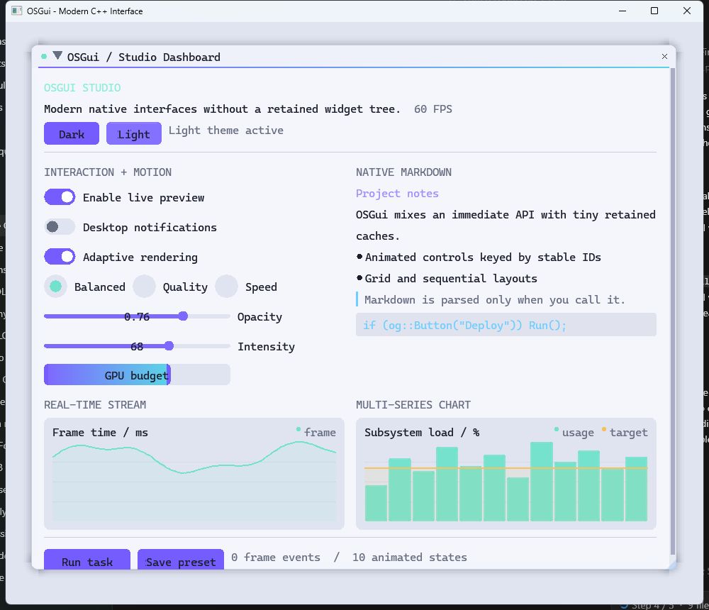

# OSGui

<p align="center">
  <strong>A modern immediate-mode GUI foundation for native C++ tools.</strong><br>
  Animated controls, smooth themes, grid layouts, native charts, and Markdown—without a retained widget tree.
</p>

<p align="center">
  
</p>

## What makes OSGui different?

OSGui keeps the convenient build-the-interface-each-frame workflow, but its
visual and technical direction is intentionally its own. The default skin uses
layered surfaces, rounded controls, gradient accents, soft shadows, animated
switches, and semantic design tokens. Small retained caches underneath the API
provide motion, theme transitions, grids, streaming data, and rich content
without making applications own widget objects.

## Implemented foundation

- **Animated modern controls** — hover fades, animated switches, radio motion,
  rounded surfaces, shadows, and gradient accents.
- **Smooth dark/light themes** — colors, spacing, radii, shadows, and motion
  settings interpolate during a theme change.
- **Hybrid layout** — ordinary sequential layout plus multi-row grid helpers.
- **Native chart builder** — line and bar series, shared scaling, legends,
  area fills, grid lines, and screen-aware downsampling.
- **Real-time data** — fixed-capacity `StreamingSeries` ring buffers.
- **Built-in Markdown** — headings, lists, quotes, rules, fenced code, links,
  and inline marker handling.
- **Frame event queue** — structured click, value-change, and window events in
  addition to familiar boolean widget results.
- **Backend-neutral core** — widgets emit vertices, indices, textures, and clip
  commands for renderer backends.
- **Zero downloaded demo dependencies** — the included example uses Win32, GDI,
  and OpenGL libraries provided with Windows.

## Build the demo

Requirements: Windows 10 or 11 and Visual Studio with the **Desktop development
with C++** workload.

The quickest Windows build is:

```bat
build.bat
osgui_demo.exe
```

`build.bat` uses the active compiler environment or asks Visual Studio's
`vswhere` utility for the newest installed C++ toolchain.

### CMake

```bat
build-cmake.bat
```

The reusable targets are `osgui` for the portable core and
`osgui_win32_opengl2` for the included Windows backend pair.

## Immediate-mode usage

```cpp
OG_ImplOpenGL2_NewFrame();
OG_ImplWin32_NewFrame();
og::NewFrame();

og::Begin("Project settings");

static bool preview = true;
static float opacity = 0.75f;
og::Checkbox("Live preview", &preview);
og::SliderFloat("Opacity", &opacity, 0.0f, 1.0f);

if (og::Button("Apply changes")) {
    ApplySettings();
}

og::End();
og::Render();
OG_ImplOpenGL2_RenderDrawData(og::GetDrawData());
```

## Themes and animation

```cpp
if (og::Button("Light theme"))
    og::SetTheme(og::Theme_Light, 0.35f);

float panel_visibility = og::Animate(
    "settings-panel",
    settings_open ? 1.0f : 0.0f
);
```

The built-in themes use semantic roles such as `Col_WindowBg`, `Col_Link`,
`Col_Success`, and `Col_WindowShadow`. Direct style editing remains available
through `og::GetStyle()`.

<p align="center">
  
</p>

## Grid layout

```cpp
if (og::BeginGrid("dashboard", 2, 16.0f)) {
    DrawControls();

    og::NextGridColumn();
    DrawInspector();

    og::NextGridColumn();
    DrawTelemetry();

    og::NextGridColumn();
    DrawActivity();

    og::EndGrid();
}
```

Grid cells accept normal widgets and can contain multiple rows. Sequential
layout remains the simplest and fastest path for ordinary panels.

## Streaming charts

```cpp
static og::StreamingSeries frame_times(2048);
frame_times.Push(delta_time_ms);

if (og::BeginChart("Frame time", og::Vec2(-1, 180))) {
    og::ChartLine("CPU", frame_times);
    og::ChartLine("budget", budget_values, budget_count,
                  og::GetColorU32(og::Col_Warning));
    og::EndChart();
}
```

Multiple line and bar series share a scale. Large line series are reduced to
roughly the visible pixel width before geometry is generated.

## Markdown

```cpp
og::Markdown(
    "## Build status\n"
    "- **Core:** ready\n"
    "- **Renderer:** running\n"
    "> No external Markdown extension required."
);
```

The current parser is intentionally lightweight. Full Unicode shaping,
selectable links, images, and cached document trees are planned for the richer
text-engine milestone.

## Repository map

| File | Purpose |
| --- | --- |
| `osgui.h` / `osgui.cpp` | Public API and portable core systems |
| `osgui_impl_win32.*` | Win32 input, timing, and font-atlas backend |
| `osgui_impl_opengl2.*` | Dependency-free compatibility renderer |
| `osgui_demo.cpp` | Dashboard demonstrating the advanced API |
| `main.cpp` | Native Windows example host |
| `CMakeLists.txt` | Reusable core/backend targets and demo build |
| `docs/architecture.md` | Frame pipeline, subsystem boundaries, and roadmap |

## Current renderer scope

The included renderer uses fixed-function OpenGL so the demo can build without
GLAD, GLEW, GLFW, or downloaded packages. The draw-data boundary is already
backend-neutral. Shader-based OpenGL 3, DirectX 11, and Vulkan backends are the
next step for true backdrop blur, higher-quality shadows, richer text, and GPU
path rendering.

## License

OSGui is available under the [MIT License](LICENSE).
