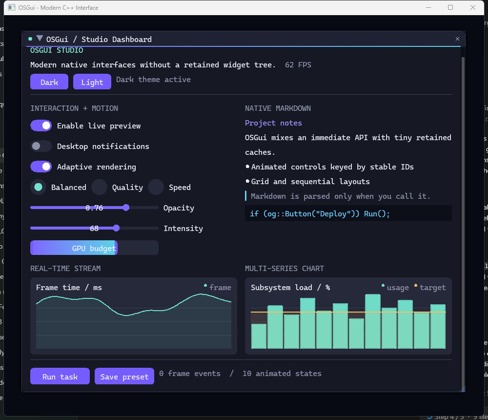

<div align="center">

# OSGui v2

### Immediate-mode UI for instrument-grade native C++ tools

Build animated editors, launchers, overlays, node canvases, and telemetry
surfaces with a frame-driven API, inspectable state, and renderer-neutral draw
data.

[](#project-status)
[](#requirements)
[](https://github.com/qtWillyG/osGUI/actions/workflows/build.yml)
[](LICENSE)

[Quick start](#quick-start) | [What is in v2](#what-is-in-v2) | [Backends](#backend-capabilities) | [Documentation](#documentation) | [Status](#project-status)

</div>



> [!IMPORTANT]
> OSGui `2.0.0-alpha.1` is a working alpha. Its public API and state format may
> change before the stable v2 release. It is not yet feature-compatible or as
> battle-tested as Dear ImGui; the current limitations are listed below.

OSGui keeps the productive part of immediate-mode UI: describe the interface
each frame, keep application data in the application, and receive interaction
results immediately. V2 develops a different identity around three priorities:

- product-oriented motion and semantic themes, including reduced-motion and
  high-contrast modes;
- built-in data surfaces such as charts, metric cards, Markdown, and a compact
  node canvas;
- observability through frame metrics, ID-conflict reporting, validation, and
  capturable draw-data snapshots.

OSGui is an independent project. It is not a Dear ImGui fork and does not use
Dear ImGui source code.

## Quick start

### Requirements

- a C++11 compiler;
- CMake 3.20 or newer for the supported build and install flow;
- Windows for the bundled showcase application;
- a graphics and platform backend appropriate for the host application.

### Build from source

```sh
git clone https://github.com/qtWillyG/osGUI.git
cd osGUI
cmake -S . -B build -DBUILD_TESTING=ON -DOSGUI_BUILD_TESTS=ON
cmake --build build --config Release --parallel
ctest --test-dir build -C Release --output-on-failure
```

On Windows, `build.bat` runs the clean CMake build, test, and local install
pipeline and locates MSVC through an active developer shell or `vswhere`.

```bat
build.bat
build\osgui_demo.exe
```

See [Getting started](docs/getting-started.md) for backend setup, package
installation, and custom-backend input examples.

### Frame integration

The Windows showcase uses the Win32 platform backend with the compatibility
OpenGL renderer:

```cpp
#include "osgui.h"
#include "osgui_impl_win32.h"
#include "osgui_impl_opengl2.h"

og::Context* context = og::CreateContext();
if (!OG_CHECKVERSION()) {
    og::DestroyContext(context);
    return false;
}
if (!OG_ImplWin32_Init(hwnd)) {
    og::DestroyContext(context);
    return false;
}
if (!OG_ImplOpenGL2_Init()) {
    OG_ImplWin32_Shutdown();
    og::DestroyContext(context);
    return false;
}

while (running) {
    // Poll/forward platform events before beginning the frame.
    OG_ImplWin32_NewFrame();
    OG_ImplOpenGL2_NewFrame();
    og::NewFrame();

    if (og::Begin("Project settings")) {
        static char name[128] = "Telemetry workspace";
        static bool preview = true;
        static float opacity = 0.78f;

        og::InputText("Project", name, sizeof(name));
        og::Checkbox("Live preview", &preview);
        og::DragFloat("Opacity", &opacity, 0.01f, 0.0f, 1.0f);

        if (og::Button("Save"))
            og::AddToast("Workspace saved", og::Toast_Success);
    }
    og::End();

    og::RenderNotifications();
    og::Render();
    OG_ImplOpenGL2_RenderDrawData(og::GetDrawData());
}

OG_ImplOpenGL2_Shutdown();
OG_ImplWin32_Shutdown();
og::DestroyContext(context);
```

Forward Win32 messages to `OG_ImplWin32_WndProcHandler()`. Applications using
another window system or renderer can combine the core with a different backend
without changing widget code.

Keep a context on one owning thread for its entire lifetime, including
destruction. `SetCurrentContext()` selects among contexts owned by the calling
thread; it is not a context-migration mechanism. The bundled backends also use
backend-specific singleton state, so initialize, drive, and shut down each one
with its intended context current.

## What is in v2

| Area | Implemented in the alpha |
| --- | --- |
| **Lifecycle** | Runtime version/data-layout check; explicit current-context API; context-isolated core state with lifetime-long owning-thread affinity |
| **Input** | Queued mouse, wheel, key, Unicode text, and focus events; complete press/release pulses and event-time modifiers; ordered text-editor actions; named keys and capability flags |
| **Identity and scopes** | String, integer, and pointer ID scopes; style color/variable stacks; item-width and disabled scopes |
| **Windows and layout** | Window flags and conditions, size constraints and queries, sequential layout, grids, dock slots, child scrolling, list clipping |
| **Interaction** | Last-item queries, selectable and invisible items, typed copy-owned drag/drop payloads, keyboard focus navigation |
| **Widgets** | Buttons, toggles, sliders, drags, knobs, multiline UTF-8 text editing with selection, range clipboard, and undo/redo; combo boxes, tabs, trees, popups, tables, status badges, spinners, skeletons, and metric cards |
| **Data surfaces** | Streaming line, bar, area, scatter, pie, candlestick, and histogram charts; Markdown links/images; node canvas |
| **Presentation** | Dark, light, and high-contrast themes; transitions; reduced motion; semantic colors; notifications and glass surfaces |
| **Draw contract** | `uintptr_t` texture IDs, nested clip intersection, draw callbacks, vertex offsets, command compaction, deep-copy `DrawDataSnapshot` |
| **Diagnostics** | Per-frame counters, Metrics Studio, duplicate-ID counts, open-scope/stack validation, debug-log callback |
| **Persistence** | Versioned workspace JSON (writes v2; reads v1/v2); transactional file and memory load; bounded reads and `GetLastError()` diagnostics |
| **Distribution** | CMake build-tree aliases, install/export package, component-aware `find_package`, installed-package consumer test, Windows/Linux CI matrix |

### Scoped composition

Repeated controls should receive a stable identity. Presentation overrides and
disabled state are explicit scopes:

```cpp
for (int row = 0; row < row_count; ++row) {
    og::PushID(row);
    og::BeginDisabled(!rows[row].available);

    if (og::Selectable(rows[row].name, rows[row].selected))
        rows[row].selected = !rows[row].selected;

    og::EndDisabled();
    og::PopID();
}
```

Use `PushStyleColor`, `PushStyleVar`, `PushItemWidth`, or `SetNextItemWidth` for
temporary presentation changes. `IsItemHovered`, `IsItemActive`,
`IsItemEdited`, and the item-rectangle queries describe the control submitted
immediately before them.

Label identity follows two distinct conventions: `Label##scope` displays
`Label` and hashes the complete string, while `Changing title###stable_id`
displays the changing prefix and hashes only `stable_id`.

### Large lists and child regions

`ListClipper` skips rows outside the active clip rectangle while leaving row
storage and selection in application code:

```cpp
if (og::BeginChild("events", og::Vec2(0, 240))) {
    og::ListClipper clipper;
    clipper.Begin(event_count);
    while (clipper.Step()) {
        for (int row = clipper.display_start; row < clipper.display_end; ++row) {
            og::PushID(row);
            og::Selectable(events[row].label, events[row].selected);
            og::PopID();
        }
    }
}
og::EndChild();
```

### Draw-data capture

The live `DrawData` points into context-owned draw lists. Capture it after
`Render()` when a frame must outlive the context's next frame:

```cpp
og::Render();

og::DrawDataSnapshot snapshot;
snapshot.Capture(og::GetDrawData());
QueueForInspection(snapshot.GetDrawData());
```

Snapshots are useful for tests, frame recording, deferred consumption, and
experiments with remote transport. They do not copy application textures.

### Metrics and validation

```cpp
static bool show_metrics = true;
og::ShowMetricsWindow(&show_metrics);

if (!og::ValidateState())
    LogError(og::GetLastError());
```

Metrics Studio reports submitted and clipped items, ID conflicts, active
windows, input/UI events, animation channels, and compacted draw geometry.
Validation detects unbalanced window, grid, child, table, tab, popup, chart,
node, style, ID, item-width, disabled, texture, and effect scopes that remain
open. It is an end-of-frame scope check, not a validator for arbitrary numeric
state or every possible extra `End`/`Pop` call.

### Accessibility-oriented presentation options

```cpp
og::SetTheme(og::Theme_HighContrast, 0.0f);
og::SetReducedMotion(true);
```

These options improve visual contrast and reduce animation. They are not an OS
accessibility tree or screen-reader implementation.

## Backend capabilities

| Component | Alpha support | Important limits |
| --- | --- | --- |
| **Portable core** | C++11; no OS or graphics headers | Requires a host to provide timing, input, a font atlas, and rendering |
| **Win32 platform** | Mouse/key/text events, clipboard, DPI polling, GDI font atlas with fallback fonts | No IME composition; convenience atlas is capped and does not shape complex scripts |
| **GLFW platform** | Optional input, clipboard, framebuffer scale, and callback chaining | Does not build fonts itself: pre-populate `FontAtlas`, or register a builder for automatic initial/DPI rebuilds |
| **OpenGL compatibility** | Windows showcase, indexed rendering, scissor clipping, and optional framebuffer-copy backdrop blur | Legacy renderer; blur is advertised only when its shader path initializes and otherwise falls back to tint |
| **OpenGL 3** | Loader-driven shaders, VAO, streaming vertex/index buffers, custom textures | Backdrop blur currently renders as the translucent tint fallback |
| **DirectX 11** | Dynamic buffers, scissor clipping, texture registry, state preservation | Backdrop blur currently renders as the translucent tint fallback |
| **Vulkan** | Not implemented | Planned after the v2 draw/backend contract settles |

The renderer contract expresses nested clips, callbacks, effects, and vertex
offsets. A backend advertises optional behavior through `IO::backend_flags`;
applications should not assume an effect path is available on every renderer.

## Charts, Markdown, and nodes

These modules intentionally remain immediate-mode:

- charts accept ordinary arrays or a fixed-capacity `StreamingSeries` and emit
  geometry during `EndChart()`;
- Markdown resolves links through a callback and images through an
  application-owned `TextureID` resolver;
- node positions and graph meaning remain application data, while OSGui draws
  draggable nodes, pins, and curved links.

The modules are useful alpha building blocks, not replacements for a complete
plotting package, CommonMark implementation, or full visual graph editor.

## Persistence

```cpp
og::SaveStateJSON("workspace.json");
og::LoadStateJSON("workspace.json");

std::string state = og::SaveStateToMemory();
if (!og::LoadStateFromMemory(state.data(), state.size()))
    Report(og::GetLastError());
```

Schema v2 stores UI scale, theme metrics and colors, and saved window position,
size, scroll, collapse, and dock-slot state. `WindowFlags_NoSavedSettings`
excludes a window. Loads accept supported v1/v2 workspace data, constrain known
fields, and roll back context mutations when validation fails. Persistence
errors are reported through `GetLastError()`; they are not sent to the debug-log
callback. The format is for OSGui workspace state, not arbitrary application
documents or a general-purpose JSON Schema implementation.

## CMake package

Build-tree and installed-package consumers can use the same friendly targets:

| Target | Component | Purpose |
| --- | --- | --- |
| `OSGui::Core` | `Core` | Portable immediate-mode core |
| `OSGui::Examples` | `Examples` | Reusable example windows |
| `OSGui::OpenGL3` | `OpenGL3` | Loader-driven OpenGL 3 renderer |
| `OSGui::Win32OpenGL2` | `Win32OpenGL2` | Win32 plus compatibility OpenGL |
| `OSGui::DX11` | `DX11` | DirectX 11 renderer |
| `OSGui::GLFW` | `GLFW` | Optional GLFW platform backend |

```sh
cmake --install build --config Release --prefix /path/to/osgui
```

```cmake
find_package(OSGui 2.0 CONFIG REQUIRED COMPONENTS Core OpenGL3)
target_link_libraries(my_tool PRIVATE OSGui::Core OSGui::OpenGL3)
```

Useful configuration options include:

```text
OSGUI_BUILD_DEMO
OSGUI_BUILD_TESTS
OSGUI_BUILD_EXAMPLES
OSGUI_BUILD_OPENGL3
OSGUI_BUILD_WIN32_OPENGL2
OSGUI_BUILD_DX11
OSGUI_BUILD_GLFW_BACKEND
OSGUI_INSTALL
OSGUI_WARNINGS_AS_ERRORS
```

## Documentation

- [Getting started](docs/getting-started.md) - build, install, lifecycle, input,
  and troubleshooting.
- [Architecture](docs/architecture.md) - context, frame, draw-data, backend, and
  persistence contracts.
- [Migrating to v2](docs/migration-v2.md) - source and integration changes from
  the 0.x prototype.
- [Changelog](CHANGELOG.md) - alpha changes and known limitations.
- [Contributing](CONTRIBUTING.md) - build checks and project invariants.

## Testing and CI

The repository's GitHub Actions workflow builds Debug and Release on Windows
and Linux with warnings as errors. It runs CTest, installs the generated CMake
package, and builds a separate consumer against every component installed on
that platform. Windows also builds the showcase, Win32/OpenGL compatibility
backend, and DirectX 11; Linux builds the portable core, examples, and OpenGL 3
renderer.

The headless core suite now exercises queued pulses and modifier chords,
context isolation, clipping and command compaction, scope and child scrolling,
persistence, snapshots and textures, ordered UTF-8 editing, selection and text
history, navigation activation, integer and floating-point controls, drag/drop,
modal blocking, and broad widget smoke paths. Backend runtime matrices, fuzzing,
accessibility automation, and visual regression coverage remain gaps.

## Project status

OSGui v2 is for evaluation, experimentation, and controlled tool development.
It is not yet a drop-in alternative with Dear ImGui's breadth, compatibility,
or production history.

Known gaps:

- IME composition, grapheme-cluster-aware editing, bidirectional layout,
  complex-script shaping, and full native desktop text-control semantics;
- full drag-to-dock split/tab trees and programmable docking workspaces;
- multi-viewport/platform-window support;
- Vulkan and other modern renderer backends;
- advanced tables such as resizable/reorderable/frozen columns and multi-sort;
- a complete accessibility/automation semantic tree.

The current docking API provides deterministic edge/fill slots only. The text
editor supports mouse/keyboard range selection, callback-backed cut/copy/paste,
per-widget undo/redo, multiline input, and ordered queued key/text actions. It
still edits by Unicode codepoint rather than grapheme cluster and is not a full
native desktop text-control implementation.

## License

OSGui is available under the [MIT License](LICENSE). Commercial use,
modification, distribution, and private use are permitted when the copyright
and license notice are preserved.

See [CONTRIBUTING.md](CONTRIBUTING.md) before proposing a public API or backend
change.

<div align="center">

Built for native tools that should feel like products, not incidental panels.

</div>
