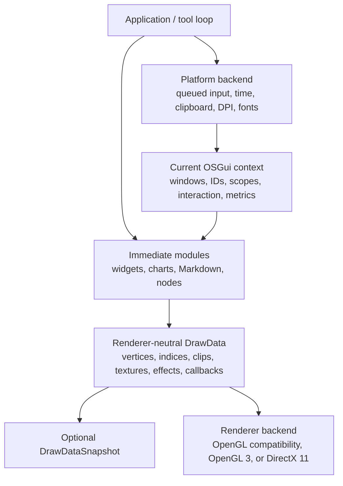

# OSGui v2 architecture

OSGui is an immediate-mode UI core for native C++ tools. Application code emits
the interface every frame and remains the source of truth for domain data. The
library retains only the UI state needed across frames and produces
renderer-neutral indexed geometry.

This document describes the `2.0.0-alpha.1` implementation. Alpha APIs and
internal boundaries may change before the stable v2 release.

## Design goals

- Keep UI declarations close to the data and actions they expose.
- Separate portable UI generation from platform input and GPU rendering.
- Make identity, temporary presentation state, and frame output observable.
- Permit more than one core context without sharing widget state.
- Preserve a small C++11 integration surface and a dependency-free core.
- Provide product-oriented motion and data widgets without hiding application
  state in a retained document tree.

OSGui v2 does not currently target full desktop text editing, OS accessibility
trees, multi-viewport window management, or feature parity with Dear ImGui.

## System map



The platform and renderer halves are intentionally independent. A host may use
the Win32 platform backend with DirectX 11, GLFW with OpenGL 3, or its own pair
of integrations.

## Context and lifetime

`CreateContext()` allocates a `Context` and makes it current. The current
pointer is thread-local and can be changed explicitly:

```cpp
og::Context* editor = og::CreateContext();
og::Context* overlay = og::CreateContext();

og::SetCurrentContext(editor);
BuildEditorFrame();

og::SetCurrentContext(overlay);
BuildOverlayFrame();

og::DestroyContext(overlay);
og::DestroyContext(editor);
```

Core auxiliary state for grids, children, tabs, popups, tables, charts,
Markdown, notifications, and nodes is keyed by context and removed by
`DestroyContext()`. It does not leak between current contexts.

The current-context mechanism does not make one `Context` safe for simultaneous
access from multiple threads and is not a context-migration mechanism. Create,
use, and destroy a context on one owning thread for its entire lifetime.
Bundled backends also own backend-specific global/device state and should be
treated as one active backend instance unless a host provides stronger
isolation.

Call `OG_CHECKVERSION()` after creating a context and before beginning frames.
It compares the header version and public data-layout sizes with the linked
implementation. This catches a common integration error: compiling against one
header while linking another library build.

## State ownership

OSGui's immediate API does not mean that all state disappears at frame end.
Ownership is divided deliberately:

| Owner | Examples |
| --- | --- |
| **Application** | Edited values, collections, selection models, node meaning and positions, chart samples, commands and undo history |
| **Core context** | Windows, scroll positions, active/hovered/focused IDs, ID-keyed animation, text cursors, popup/tab state, style scopes, frame metrics |
| **Platform backend** | Native window handle, event translation, timing, clipboard bridge, DPI and platform font building |
| **Renderer backend** | GPU font texture, custom texture registration, buffers, shaders, render-state backup |
| **Snapshot** | Deep copies of draw lists and their command/vertex/index arrays |

Application pointers placed in callback data or consumed by a texture ID remain
application-owned.

## Frame pipeline

```text
native events
    |
    +--> IO::AddMousePosEvent / AddMouseButtonEvent / AddMouseWheelEvent
    +--> IO::AddKeyEvent / AddInputCharacter / AddFocusEvent
    |
    v
NewFrame()
    - computes transitions from the accumulated IO state
    - retains the event record for frame diagnostics
    - computes mouse/key transitions and capture hints
    - advances themes and ID-keyed animation
    - starts frame-local event, item, and metrics state
    |
    v
application emits UI
    - resolves layout and clipping
    - updates application values immediately
    - records last-item data and UI events
    - appends vertices, indices, and draw commands
    |
    +--> optional ValidateState()
    |
    v
Render()
    - orders active windows
    - compacts compatible draw commands
    - appends overlay geometry
    - finalizes DrawData and metrics
    |
    +--> optional DrawDataSnapshot::Capture()
    |
    v
renderer backend
    - scales logical clips to the framebuffer
    - runs draw callbacks
    - binds textures/effect behavior
    - submits indexed triangles using index and vertex offsets
    - restores caller graphics state
```

`Begin()` and `End()` must always be paired, including when `Begin()` returns
false. The same rule applies to every successful `BeginXxx()` scope that
documents a matching `EndXxx()`.

## Input contract

`IO` holds stable per-frame input state and a vector of `InputEvent` records.
Platform backends should prefer the event helpers over mutating arrays directly:

```cpp
og::IO& io = og::GetIO();
io.AddMousePosEvent(x, y);
io.AddMouseButtonEvent(0, pressed);
io.AddMouseWheelEvent(horizontal, vertical);
io.AddKeyEvent(og::Key_Space, pressed);
io.AddInputCharacter(codepoint);
io.AddFocusEvent(focused);
```

Each helper updates the corresponding `IO` state and appends an event record.
`NewFrame()` computes key and pointer transitions from the accumulated state;
`Render()` clears text, wheel deltas, and the frame's event record. The current
alpha does not replay every native transition as a separate widget update
within one UI frame.

Named `Key` values remove native key-code assumptions from application code.
The current enum keeps common Win32-compatible numeric values to ease 0.x
migration, but non-Windows backends still translate their native keys.

`want_capture_mouse`, `want_capture_keyboard`, and `want_text_input` are output
hints for the host. Inputs should still be forwarded to OSGui so it can observe
focus loss, releases, and clicks outside its windows.

### Backend capabilities

The host/backends identify themselves through `backend_platform_name` and
`backend_renderer_name`, and advertise optional behavior through
`backend_flags`:

- `BackendFlags_HasClipboard`
- `BackendFlags_HasMouseCursors`
- `BackendFlags_HasSetMousePos`
- `BackendFlags_RendererHasTextures`
- `BackendFlags_RendererHasEffects`
- `BackendFlags_RendererHasVtxOffset`

Capability flags are facts about an active integration, not compile-time
promises. Widget code should keep a visually usable fallback when an effect is
unavailable.

## Stable identity and scopes

Widget labels are hashed with the current ID stack. Text before `##` is visible;
the complete label participates in identity. Repeated or dynamically generated
controls should add a scope with `PushID()` and `PopID()`.

OSGui tracks IDs submitted in the frame. Duplicate submissions increment the
ID-conflict metric, which Metrics Studio surfaces. An ID conflict does not
create two independent controls: callers must fix the scope.

Temporary state follows explicit stack discipline:

- `PushStyleColor()` / `PopStyleColor()`
- `PushStyleVar()` / `PopStyleVar()`
- `PushItemWidth()` / `PopItemWidth()`
- `BeginDisabled()` / `EndDisabled()`

`ValidateState()` checks these and the structural Begin/End stacks. It reports
the first detected imbalance through `GetLastError()` and the optional debug-log
callback.

## Layout, children, and clipping

Sequential cursor layout is the default. `SameLine`, indentation, item width,
and explicit cursor positioning refine that fast path. Higher-level containers
temporarily replace a subset of layout state and restore the parent when they
end:

- grids partition available width into fixed columns;
- tables provide basic rows, columns, selection, and single-column sorting;
- child regions provide an independently clipped and vertically scrolled area;
- edge/fill dock slots resolve a window against the display rectangle.

`ListClipper` computes the visible row interval from the current clip rectangle
and a uniform row height. It changes only which rows the application emits; it
does not own row storage or selection.

Draw-list clip rectangles use logical display coordinates. `PushClipRect()`
intersects with the current clip by default, so nested children, tables, and
custom draw operations cannot expand beyond their parent accidentally.
Renderer backends apply `framebuffer_scale` before issuing native scissors.

## Items and interaction

Every submitted interactive item records `LastItemData`: stable ID, rectangle,
visibility, hover, active, focus, click, edit, and disabled flags. Public
last-item queries are valid immediately after the widget they describe.

Typed drag/drop payloads are copied into context-owned memory by
`SetDragDropPayload()`. The accepted `Payload` view is valid for the active
drag/drop operation; application code should copy data it needs to keep longer.

`Selectable`, `InvisibleButton`, sliders, drags, and knobs use the same
interaction model. Composite presentation widgets such as status badges,
spinners, skeletons, and metric cards build on the same layout/draw primitives.

## Themes and motion

The `Style` structure uses semantic color roles and shared layout metrics.
`SetTheme()` interpolates from the current style to dark, light, or
high-contrast presets. `Animate()` exposes the same ID-keyed animation cache to
application code.

Reduced motion is a context setting. `SetReducedMotion(true)` reduces or skips
decorative transitions through `motion_scale` while leaving interaction logic
intact. This is a visual accommodation, not a substitute for a semantic
accessibility tree.

## Draw-data contract

The core produces one `DrawList` per active window plus an overlay list. Each
list owns:

- `DrawVert` entries containing position, UV, and packed RGBA color;
- 32-bit `DrawIdx` entries;
- `DrawCmd` batches containing a logical clip rectangle, `TextureID`, index and
  vertex offsets, element count, effect metadata, and an optional callback.

`TextureID` is `uintptr_t`, so it can represent a native integer handle or a
pointer-sized registry token on 32-bit and 64-bit builds. Interpretation remains
renderer-specific.

`CompactCommands()` removes empty batches and merges adjacent compatible
commands. A callback, texture/effect transition, or incompatible clip is a batch
boundary. Renderer backends must honor both `idx_offset` and `vtx_offset`.

Draw callbacks run during backend consumption while renderer state is active.
`callback_data` is a non-owning pointer and must remain valid until rendering
finishes. A backend must restore its standard UI render state after a callback
before continuing normal commands.

### Effects

`DrawEffect_BackdropBlur` is carried in the ordinary command stream. The
compatibility OpenGL backend implements it by copying the framebuffer and
sampling that copy, which is convenient but expensive. OpenGL 3 and DirectX 11
currently render the translucent tint fallback. Future effect implementations
can change backend behavior without changing widget APIs.

### Snapshots

`DrawData` references draw lists owned by the current context and is replaced by
the next rendered frame. `DrawDataSnapshot::Capture()` deep-copies lists,
commands, vertices, and indices, then repairs `DrawData::lists` to point at the
owned copies.

Snapshots make CPU-side output independently lifetime-safe. They do not clone
GPU textures, callback data, or application resources referenced by commands.

## Diagnostics

`FrameMetrics` records:

- active windows, submitted items, and clipped items;
- duplicate IDs;
- draw-list, command, vertex, and index counts;
- queued input events and emitted UI events;
- active animation states.

`ShowMetricsWindow()` presents these counters in Metrics Studio.
`SetDebugLogCallback()` lets a host route version, validation, and persistence
errors to its own logger.

Metrics are diagnostic counters, not a profiler. Timing and allocation
instrumentation remain host responsibilities.

## Persistence

The v2 serializer writes a small JSON workspace document with:

- schema `version: 2`;
- UI scale and theme metrics/colors;
- saved window position, size, scroll, collapse state, and dock slot.

The same representation is available through files (`SaveStateJSON`,
`LoadStateJSON`) and memory (`SaveStateToMemory`, `LoadStateFromMemory`). File
loads are bounded to 16 MiB, numeric values are range-limited, and failures are
available through `GetLastError()`.

The loader is intentionally a narrow workspace-state reader rather than a
general JSON library. Application documents, node graphs, chart samples, and
business data remain outside this schema. `WindowFlags_NoSavedSettings`
prevents transient windows from being serialized.

## Built-in modules

### Charts

`StreamingSeries` is a fixed-capacity float ring buffer. The chart builder
collects line, bar, area, scatter, pie, and candlestick series and emits geometry
at `EndChart()`. Dense line series are reduced toward visible pixel width.

The alpha chart API does not yet provide interactive axes, zoom, crosshairs, or
advanced sampling guarantees.

### Markdown

The lightweight Markdown renderer handles headings, lists, quotes, rules,
fenced code lines, links, callback-resolved images, and simple wrapping. Link
and image policy stays with the host.

It is not a complete CommonMark parser and does not build a retained document
tree.

### Node canvas

The node canvas draws and drags application-owned node positions, labels pins,
and renders curved links. OSGui does not own the graph model or serialize it.

Interactive link authoring, graph selection, pan/zoom, minimaps, and command
history are outside the current alpha.

## Bundled backends

- **Win32** translates native input into the queue, bridges UTF-8 clipboard
  text, tracks DPI, and builds a capped convenience GDI atlas with fallback
  fonts. It does not implement IME composition or complex shaping.
- **GLFW** translates callbacks and polling state, supports clipboard and
  framebuffer scale, and requires an application-supplied font builder.
- **OpenGL compatibility** supports the dependency-light Windows showcase and
  framebuffer-copy blur.
- **OpenGL 3** uses loader-provided entry points, shaders, a VAO, and streaming
  buffers.
- **DirectX 11** uses dynamic buffers, compiled shaders, a texture registry,
  DPI-correct scissors, and caller-state restoration.

The modern renderers preserve caller graphics state, execute draw callbacks,
and honor vertex offsets. Vulkan, multi-viewports, and platform windows are not
implemented.

## Known limitations

The v2 alpha deliberately leaves several large systems incomplete:

- editable text operates by Unicode codepoint and lacks IME composition,
  grapheme-cluster movement, bidirectional layout, and full native desktop
  text-control semantics;
- the dock-slot API is not a complete drag-to-dock split and tab tree;
- multi-viewport platform windows are not implemented;
- there is no Vulkan renderer;
- the built-in font paths do not provide complete shaping, bidirectional text,
  or exhaustive CJK coverage;
- automated coverage is not yet broad enough to claim Dear ImGui feature or
  performance parity.

These are current product constraints, not implied capabilities of the
immediate-mode architecture.

## Build and distribution boundary

`osgui.h` and `osgui.cpp` form the portable core. CMake produces independent
targets for optional examples and backends, installs selected headers and
libraries, and exports component-aware `OSGui::` targets. A separate consumer
project verifies that the installed package can be found, linked, and run.

The supported CI matrix covers Windows and Linux in Debug and Release, with
warnings treated as errors, CTest execution, installation, and installed-package
consumption.

## Extension rules

New widgets and modules should preserve these invariants:

1. Application data remains application-owned unless the API explicitly says
   otherwise.
2. Every interactive item has a stable, scope-derived ID.
3. A clipped item updates layout correctly and avoids unnecessary geometry.
4. Begin/End and Push/Pop stacks can be checked by `ValidateState()`.
5. Draw output remains backend-neutral and uses logical coordinates.
6. Optional renderer behavior has a usable fallback and a capability flag.
7. Public API changes update the migration guide and changelog.

See [CONTRIBUTING.md](../CONTRIBUTING.md) for the build and review checklist.
